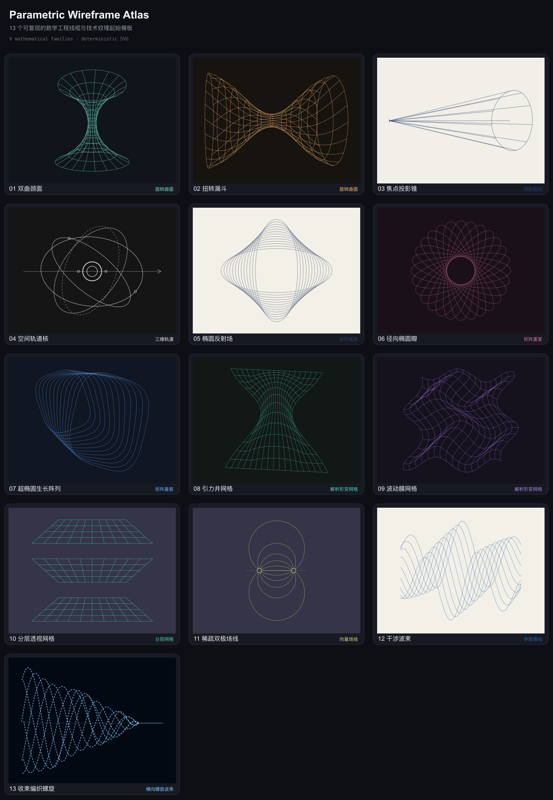

# Parametric Wireframes

一套确定性的参数化工程线框生成器与 Codex Skill。它把参考图拆解为可解释的数学结构，通过场景 JSON 批量生成 SVG、PNG、参数文件和对比预览，而不是使用图片生成模型临摹。



## 在线图集

打开 [`docs/index.html`](docs/index.html) 可浏览 13 个模板，并一键复制每个模板的 SVG 或场景参数。

## 支持的几何家族

- 旋转曲面与工程网格
- 焦点投影射线
- 三维轨道环
- 矩阵变换阵列
- 解析形变网格
- 参数曲线与干涉波束
- 横向收束编织螺旋
- 分层透视网格
- 稀疏偶极场线

## 使用

需要 Node.js 18 或更高版本。只有 PNG 导出与预览图生成依赖 `sharp`。

```bash
npm install
node scripts/render.cjs --scene assets/scenes/converging-helix.json --out output
node scripts/export-png.cjs --manifest output/manifest.json
node scripts/build-contact-sheet.cjs --manifest output/manifest.json
```

重建完整图集：

```bash
npm run gallery
```

运行验证：

```bash
npm test
```

## 作为 Codex Skill 安装

将仓库复制到 `~/.codex/skills/generate-parametric-wireframes/`，随后可在 Codex 中使用 `$generate-parametric-wireframes` 调用。

场景结构、家族选择规则与参考图分析方法分别记录在 [`SKILL.md`](SKILL.md) 和 [`references/`](references/) 中。
